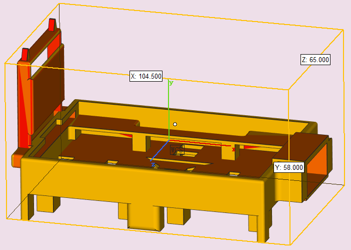
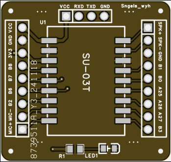
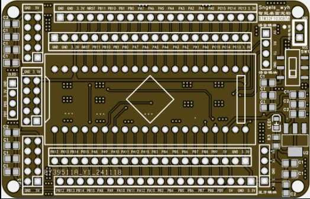
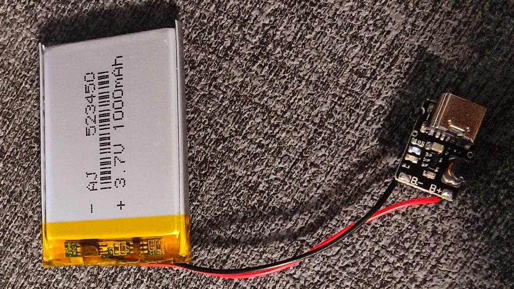
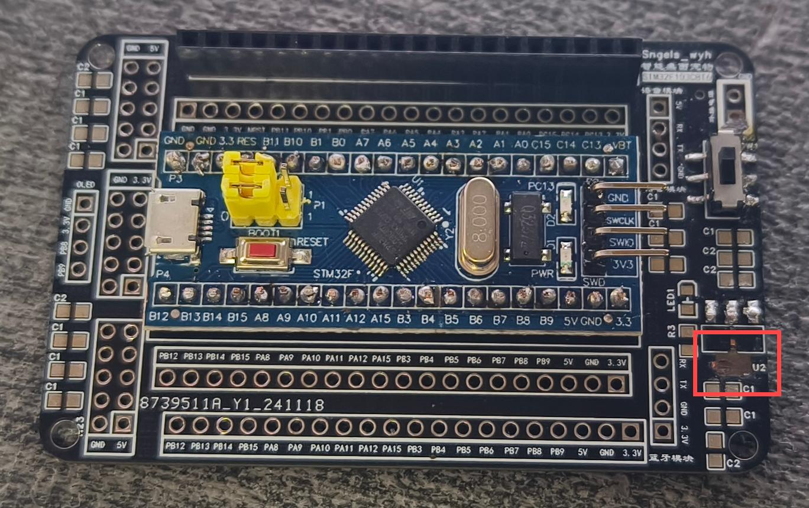

# 2024-11-21 智能语音桌宠 
---
### 更新2024-11-21
---
最近在网上看了一个智能语音桌宠（作者@Sngels_wyh），想要╰(*°▽°*)╯

在这里做一个小教程

## 料清单：

1. 5个SG90 9G舵机

2. STM32F103C8T6芯片单片机开发板

3. 1.3寸 OLED显示屏 4引脚

4. 5V充放电一体模块

5. 3.7V聚合物锂电池

6. SU-03T语音模块

7. 咪头

8. 小喇叭扬声器

9. 蓝牙模块（如果会用电脑的串口调控的话可不需要）

10. CH340串口下载模块

11. 26AWG电线

12. 0805贴电容0.1UF与10UF

13. 0603贴片LED（0805应该也行）

14. SS-3235S-L1开关

15. 2.54mm 1*20P 排母 与1*4P 排母

16. AMS1117-3.3V

17. 0805贴片电阻10K

18. 2.54mm 排针2*8P

19. 面包板飞线（用于连接pwm线与单片机引脚）

20. 3D打印外壳

#### 外壳

21. pcb板

语音模块

主体

## 焊接：

1.  5V充放电一体模块和7V聚合物锂电池焊在一起，用于锂电池的充电(红线是正接 B+与黑线是负接 B-)

焊上充放电模块小灯就亮了。嘿嘿嘿

### 更新2024-11-23

2. 

破电烙铁把板子掀了（呜呜呜），单片机也拿不下来了只能重新下单了，这次用锡膏加热风机。

